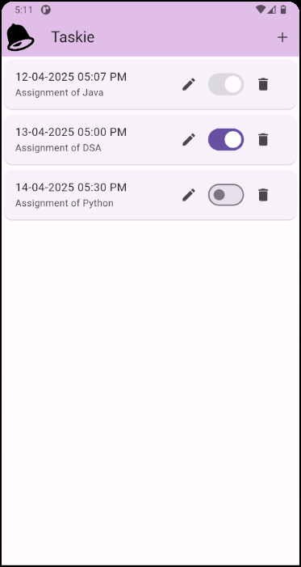
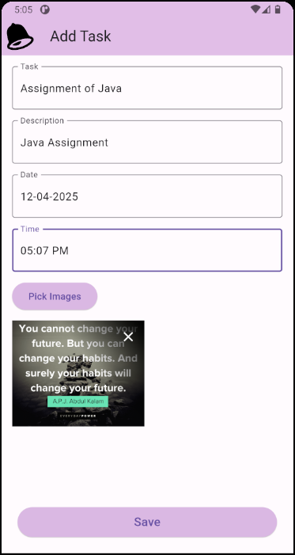
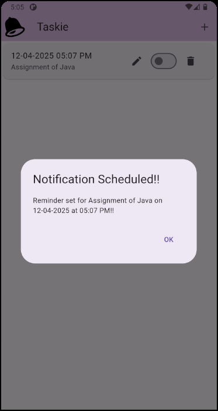
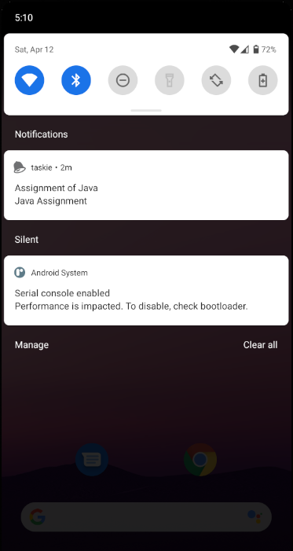
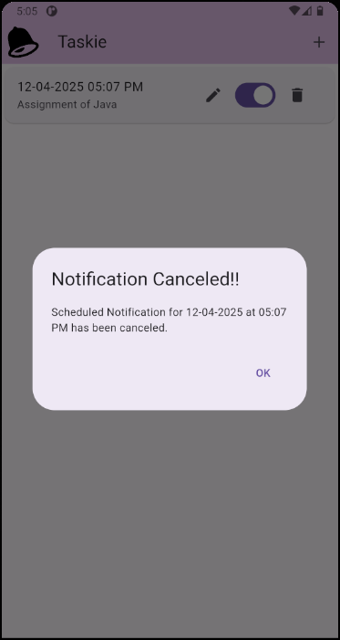

# 📘 Taskie

**Taskie** is a smart and lightweight Flutter app that helps you manage tasks with scheduled **local notifications**, **timezone-aware reminders**, and image attachments. Schedule it, toggle reminders, attach a motivating image — and boom, you're organized like a boss.

---

## ✨ Features

- 📆 **Add tasks with date & time**
- 🔔 **Schedule push notifications** using `flutter_local_notifications`
- 🌐 **Timezone-aware scheduling** powered by `flutter_timezone`
- 🟣 **Toggle reminders** for individual tasks using a switch
- 🖼️ **Attach images** to give your tasks more context or vibes
- 📝 **Full CRUD support** – create, edit, delete tasks at will
- 💾 Persistent local storage with `sqflite`
- 🎨 Clean and smooth UI built with Flutter’s Material goodness

---

## 🧪 Use Case Example

1. Add a task like *“Submit Flutter assignment”* with a specific date and time.
2. (Optional) Attach an image as a visual cue or motivational nudge.
3. Turn on the reminder switch to schedule a push notification.
4. Let **Taskie** do its thing — you'll get notified right on time!

---

## 🖼️ Screenshots

<p align="left">
  
  
  
  

</p>


---

## 🚀 Getting Started

To run this app locally:

```bash
flutter pub get
flutter run
